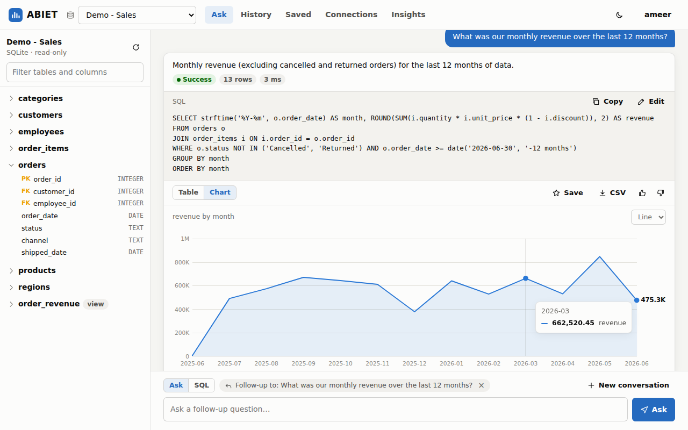
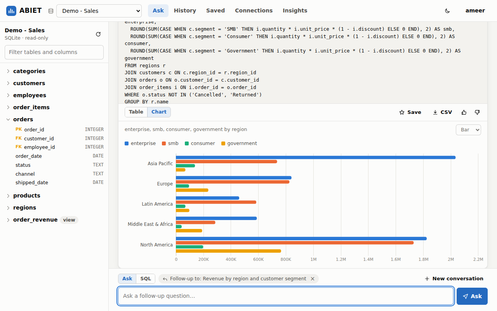
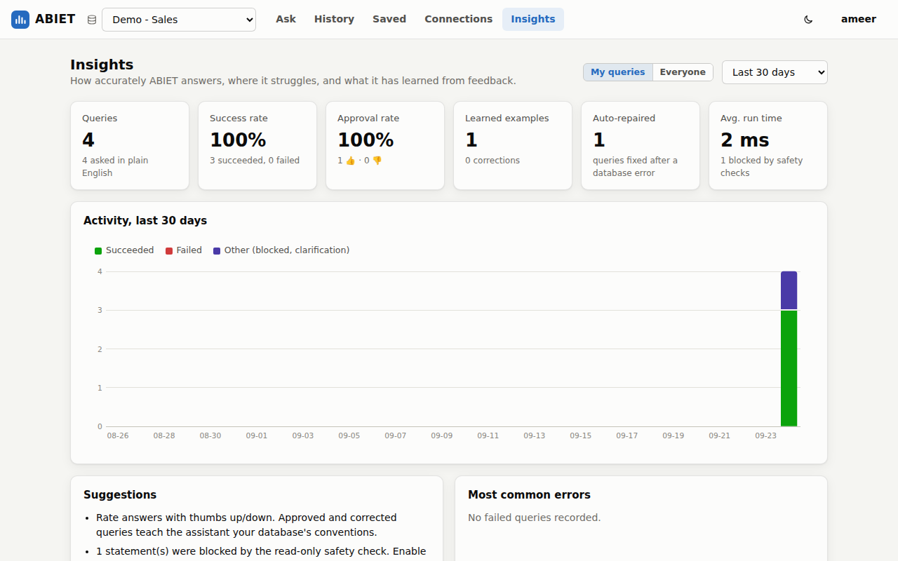
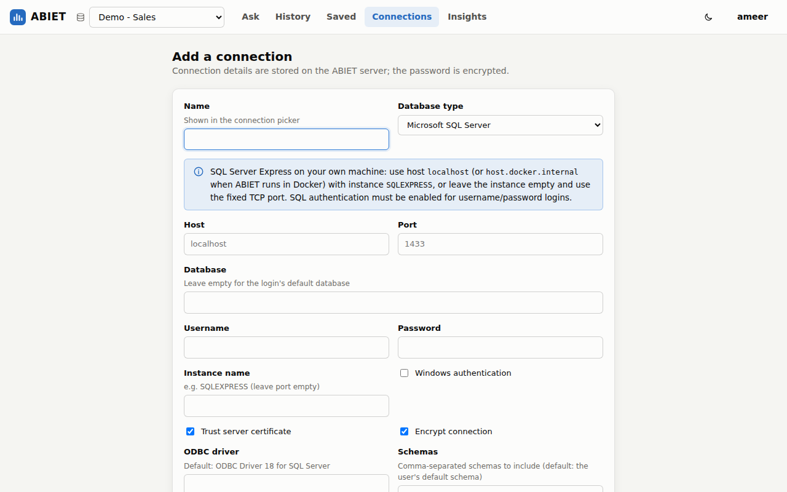
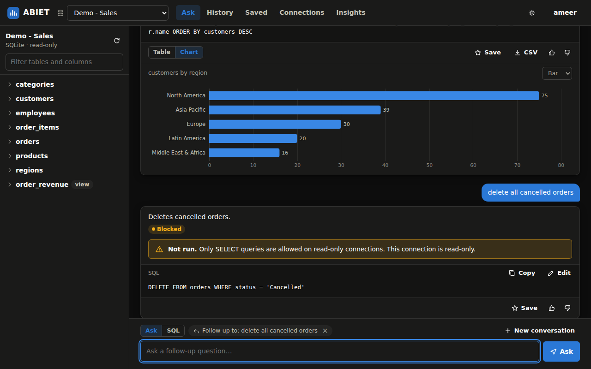

# ABIET — Database AI Assistant

**Artificial Business Intelligence Enabled Tool.** Ask your databases questions in plain English and get answers:
ABIET reads your schema, writes the SQL, checks it for safety, runs it, explains the result, charts it, and learns
from your feedback.



## Features

- **Plain-English questions → SQL.** Schema-aware and dialect-aware prompts for SQL Server, PostgreSQL, Oracle,
  MySQL/MariaDB and SQLite. ABIET sends the relevant tables, columns, keys and real category values (e.g. which
  order statuses exist) to the model, so generated SQL uses names and filters that actually exist.
- **Conversations.** Ask follow-up questions ("only 2025", "split by region"); ABIET asks you when a question is
  ambiguous instead of guessing.
- **Self-repair.** If a query fails, ABIET sends the database error back to the model and retries once.
- **Safe by default.** Connections are read-only unless you opt in. Every statement passes a layered safety check
  (SQL parsing, keyword scan and a denylist of side-effecting functions) and read-only queries run in transactions
  that are always rolled back. Write statements on writable connections always need your confirmation.
- **Learns from feedback.** Mark answers 👍 or correct the SQL on 👎 answers; approved and corrected queries are
  reused as examples for similar questions on the same database.
- **Results you can use.** Sortable tables, automatic line/bar charts, CSV export of full results, editable SQL,
  history, saved queries, and a SQL mode for writing queries yourself.
- **Insights.** Success and approval rates, common errors, auto-repairs, activity over time, and optional AI
  analysis of how to improve accuracy.
- **Multi-user.** Accounts with JWT sessions; each user has private connections, history and learned examples.
  Connection passwords are encrypted at rest.
- **Try it instantly.** A built-in sample sales database (customers, products, orders, sales reps across five
  regions) lets you explore ABIET before connecting your own data.

| | |
|---|---|
|  |  |
|  |  |

## Quick start

### Docker Compose (recommended)

```bash
cp .env.example .env        # set OPENAI_API_KEY, and a SECRET_KEY for anything beyond local use
docker compose up -d --build
```

Open <http://localhost:8000>, create an account (the first account is the administrator), and click
**Try the demo database**. ABIET stores its own data in PostgreSQL (the `db` service).

### Without Docker

Requires Python 3.11+.

```bash
python -m venv .venv && source .venv/bin/activate
pip install -r requirements.txt
cp .env.example .env        # set OPENAI_API_KEY
uvicorn backend.main:app --port 8000
```

ABIET keeps its data in `./data` (SQLite) unless `DATABASE_URL` is set. SQL Server connections additionally need
[unixODBC and the Microsoft ODBC Driver 18 for SQL Server](https://learn.microsoft.com/sql/connect/odbc/linux-mac/installing-the-microsoft-odbc-driver-for-sql-server)
on Linux/macOS (Windows ships with it).

Without `OPENAI_API_KEY` ABIET still runs: you can connect databases, browse schemas and run SQL, but not ask
questions in plain English.

## Connecting databases

Add connections under **Connections → Add connection**, test them, then pick one in the top bar.

| Database | Notes |
|---|---|
| **Microsoft SQL Server** | Uses ODBC Driver 18. For a named instance such as SQL Server Express enter the instance name (e.g. `SQLEXPRESS`) and leave the port empty, or use the instance's fixed TCP port. From Docker, reach a server on your machine as `host.docker.internal`. Windows authentication works when ABIET itself runs on Windows. |
| **PostgreSQL** | Optional SSL mode and a comma-separated list of schemas to include. |
| **Oracle** | Enter the service name (e.g. `XEPDB1`). Uses the thin `oracledb` driver, so no Oracle client is needed. |
| **MySQL / MariaDB** | Standard host/port/database. |
| **SQLite** | Files placed in `data/databases/` on the ABIET server. |

**Use a read-only database account.** ABIET enforces read-only access itself, but a database user with only
`SELECT` permissions is the strongest guarantee. Enable **writes** on a connection only when you want ABIET to run
`INSERT`/`UPDATE`/`DELETE` statements, which then always require confirmation.

When a connection's schema changes, press the refresh button in the schema panel.

## AI providers

ABIET uses the OpenAI Chat Completions API (`AI_MODEL`, default `gpt-4o-mini`). To use another provider that speaks
the same API — Azure OpenAI, Ollama, vLLM, LM Studio, and many hosted services — set `OPENAI_BASE_URL` (and
`OPENAI_API_KEY` if the server needs one). If the server does not support JSON response mode, set
`AI_JSON_MODE=false`.

What is sent to the provider: your question, earlier questions in the same conversation, the schema of the
connected database (table/column names, types, keys, comments), up to ten sample values of short categorical text
columns, and previously approved queries for similar questions. Query **results are never sent.** Columns that
look like personal data (names, emails, phone numbers, addresses, …) are never sampled; you can turn sampling off
per connection.

## Configuration

All settings are environment variables (or a `.env` file); see [`.env.example`](.env.example) for the full list.
The most important ones:

| Variable | Default | Purpose |
|---|---|---|
| `OPENAI_API_KEY` | – | Enables natural-language questions |
| `AI_MODEL` | `gpt-4o-mini` | Model used to write SQL |
| `OPENAI_BASE_URL` | – | OpenAI-compatible server to use instead of OpenAI |
| `SECRET_KEY` | generated in `DATA_DIR` | Signs sessions and encrypts stored passwords |
| `DATABASE_URL` | SQLite in `DATA_DIR` | ABIET's own database |
| `ALLOW_REGISTRATION` | `true` | Allow sign-ups after the first (admin) account |
| `QUERY_MAX_ROWS` / `EXPORT_MAX_ROWS` | `1000` / `50000` | Rows shown / exported |
| `QUERY_TIMEOUT_SECONDS` | `30` | Per-query time limit |

## How it works

```
question ──► schema (cached, relevance-ranked) + similar approved examples + conversation
          ──► language model ──► SQL + explanation + chart suggestion
          ──► safety check ──► read-only transaction ──► results, table, chart
                 │                    │ error
                 │ write/unsafe       └─► model repairs the SQL using the error ──► run again
                 └─► blocked, or awaiting confirmation (writable connections only)
feedback (👍 / corrected SQL) ──► learning engine ──► examples for future questions
```

See [docs/ARCHITECTURE.md](docs/ARCHITECTURE.md) for the components, data model and security design, and
[docs/DEVELOPMENT.md](docs/DEVELOPMENT.md) for running tests and contributing. Interactive API documentation is
served at `/docs`.

## Project status

Version 1.0. Backed by 160+ automated tests (unit, API, PostgreSQL and MySQL integration, and a browser end-to-end test) that
run in CI along with a Docker build.
